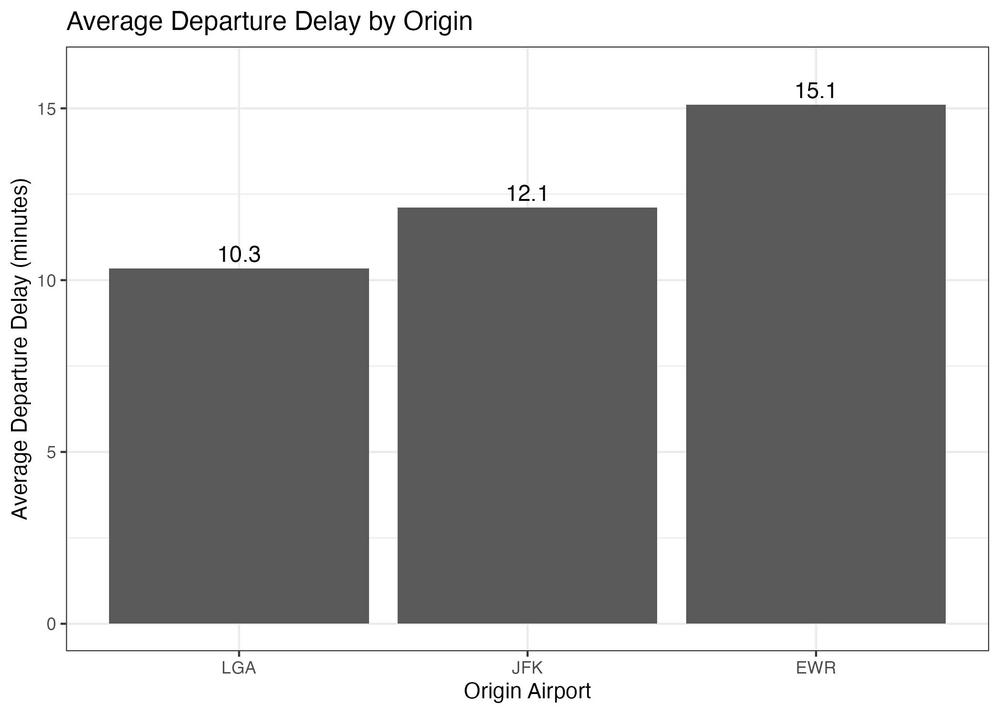
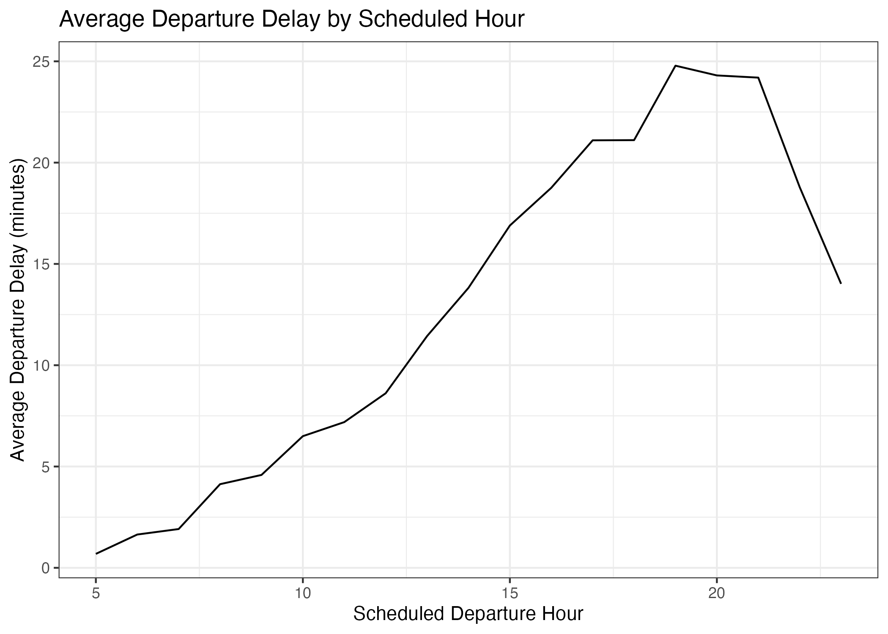

# NYC-flights
## Research Question: 
What factors are associated with departure delays for flights departing from New York City airports in 2013?
## Data source: 
This project uses the nycflights13 database from nycflights13 package in R. It covers flights leaving EWR, JFK and LGA in 2013. 
## Tools: 
SQL, SQLite, R, ggplot2
## Observations: 
This exploratory data analysis (EDA) provided multiple directions for further analysis. 
- Average departure delays differ between EWR, LGA and JFK. This indicates independently investigating the cause of delays at each airport is a useful next step.
- Departure delays appear to vary by month, with June and July having the highest average delays.
- Departure hour appears to be associated with delay, with flights departing around 8pm having the highest average delays while flights leaving early in the morning the lowest.
- No unadjusted weather phenomenon, including precipitation and visibility, appear to have a strong association with departure delays. 
## Limitations:
- This analysis is solely descriptive. It does not test statistical significance or establish causation. 
- Data from all three airports are being analyzed together. Future analysis could analyze them separately or include origin airport as a predictor in a statistical model.
- Flights with no recorded departure delay were excluded, which may have affected results. 
## Visualization

## Reproduce the Analysis
Install the required R packages and render the Quarto analysis file. 

install.packages(c("DBI", "RSQLite", "nycflights13", "magrittr", "ggplot2")
